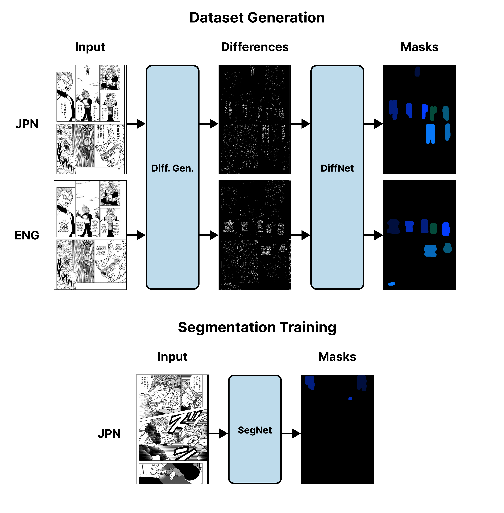

<h1 align="center">
  Image Difference Segmentation
  <br>
</h1>

<h4 align="center">Automatically generate segmentation masks and train segmentation models from image differences.</h4>



This project enables creation of large binary segmentation datasets through use of image differences. Certain domains, such as comic books or manga, take particularly well to the proposed approach. Creating a dataset and training a segmentation model involves two manual steps (outside of the code in this repository):

1. Finding and sorting suitable data. Ideally, your data should have two or more classes wherein the only difference between the classes should be the subject that is to be segmented. An example would be an English page from a comic and a French page from the same comic.

2. Segmentation masks must be manually created for a small number of image differences. Using a pretrained DiffNet requires only 20-50 new masks. Re-training DiffNet from scratch requires 100-200 masks. For quickly generating binary segmentation masks, [simple-masker](https://github.com/Brikwerk/simple-masker) was written/used.

## Prerequisites

The following must be on your system:

- Python 3.6+
- An accompanying Pip installation
- Python and Pip must be accessible from the command line
- An NVIDIA GPU that is CUDA-capable (6GB+ of VRAM likely needed)

## Installation

1. Clone the repository to a convenient location.

```bash
git clone https://github.com/Brikwerk/image-difference-segmentation
```

2. Navigate to the repository on your command line and install the required packages with pip. Please note, you may need to install PyTorch/Torchvision using installation links at https://pytorch.org

```bash
pip install -r requirements.txt
```

## Creating a Dataset

1. Before beginning, make sure you have your data sorted into class-based folders. In the below example, the `Comic_Pages` dataset contains two classes, ENG and FRENCH. Each class should contain images that roughly match. For example, a page from the same comic book but in different languages.

```
Comic_Pages
    |
    --> ENG
    |    |
    |     --> 00001.png
    |     --> 00002.png
    |         ...
    --> FRENCH
        |
        --> 00001.png
        --> 00002.png
            ...
```

2. Run the `match_images.py` folder to (A) match up all images between the two classes and (B) generates image differences. `match_images.py` takes CLI arguments that determine where data comes from and where data goes. For details on the CLI arguments, run the file with the `--help` flag.

```bash
python match_images.py --help
```

The strictly necessary flags are the `a_root`, `b_root` and `dst_root` flags. Other flags can be used to finetune output for better results.

3. You should have two folders in your destination directory: `a_images` and `b_images`. Both will contain the warped/matched/renamed input images and the respective differences images for each class.

## Creating Masks from Difference Images

To create masks for a folder full of difference images, run the `batch_process.py` file. The main CLI arguments associated with this file are:

- weights_path: The path to a weights file for a DiffNet instance
- input_path: The to path to a folder that contains difference images
- output_path: The path to a folder where masks will be output. This folder does not necessarily need to exist.

For more info on other configuration options, run `batch_process.py` with the `--help` flag:

```bash
python batch_process.py --help
```

## Training a DiffNet or SegNet instance

To train an instance of DiffNet or SegNet, run the `train.py` file. The following arguments must be specified for a proper training run:

- images_path: The to path to a folder that contains input images
- masks_path: The path to a folder that contains masks.

The above image/mask pairs should match name-wise.

For more info on other configuration options, run `train.py` with the `--help` flag:

```bash
python train.py --help
```

## Using a Pretrained Model

### Downloading the Weights File

Weights for this project are hosted at [HuggingFace](https://huggingface.co/brikwerk/image-difference-segmentation) under `weights` directory. Currently, a DiffNet instance trained on text differences is provided. To use this model, download it and move it to the weights directory in your local copy of this repository.

### Using Pretrained Weights

Pretrained weights can be used in the `batch_process.py` file and the `evaluate.py` file. For both files, specify the path to your weights file using the `--weights_path` CLI argument.

## License

MIT
